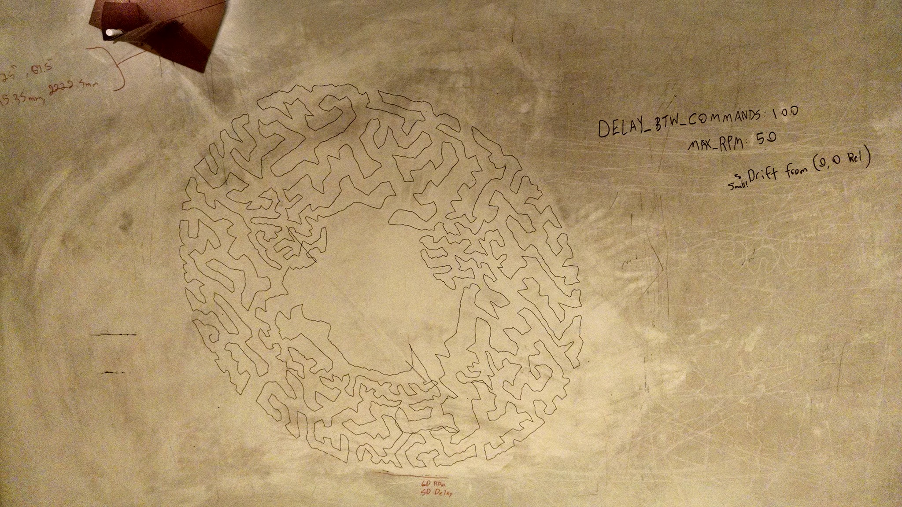
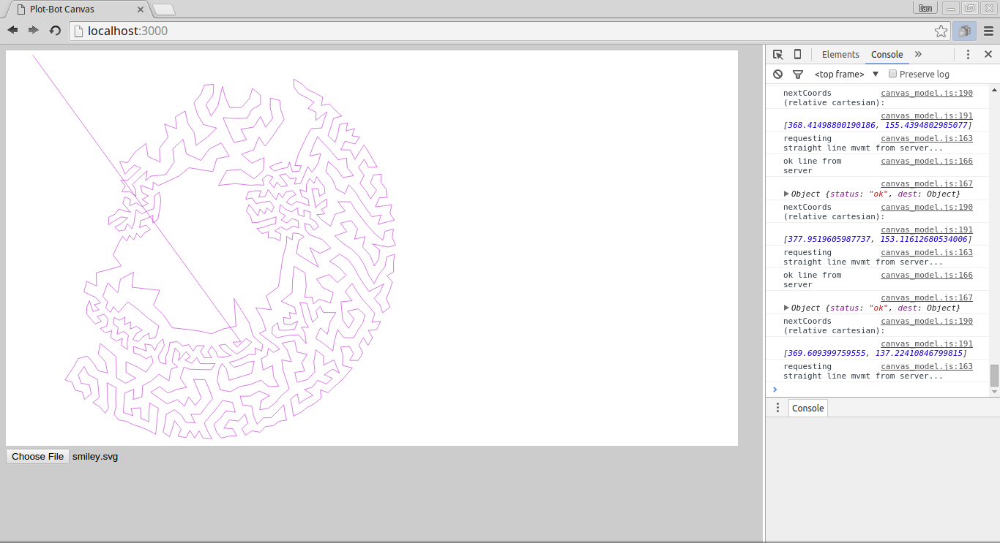
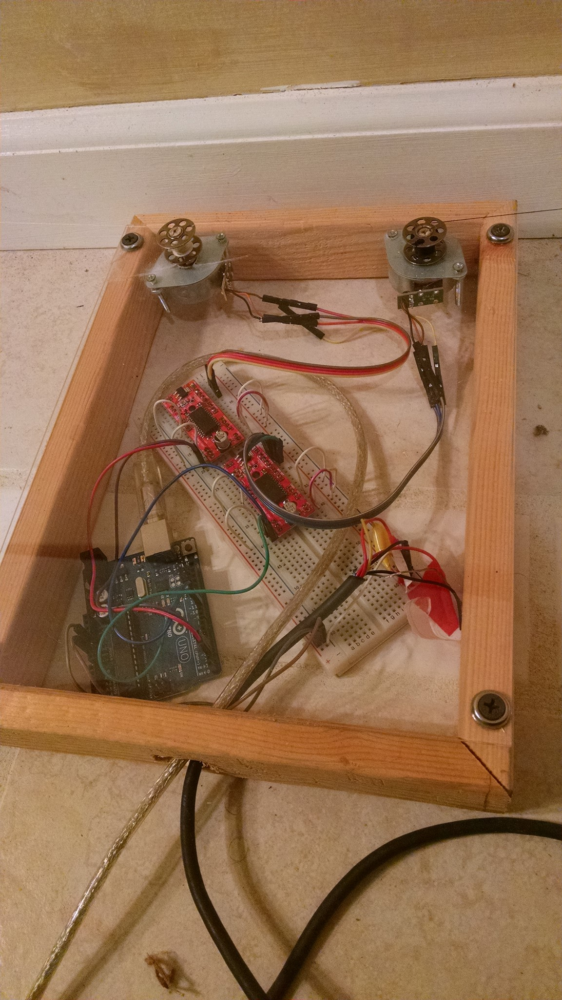
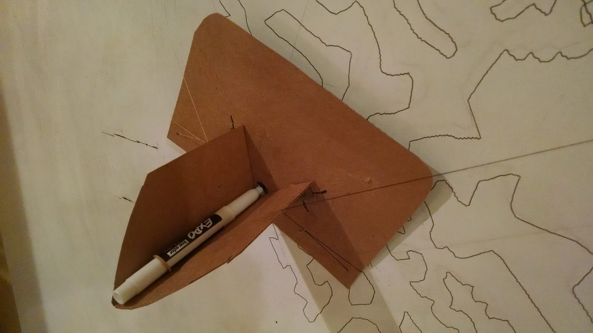
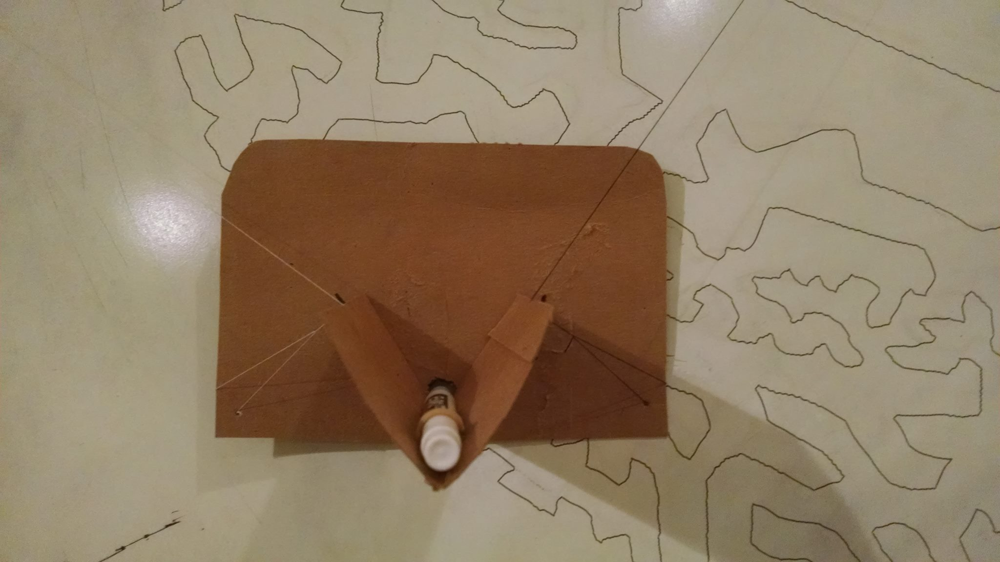

# plot-bot
A v-plotter / Polargraph-type drawing robot actuated with johnny-five and with simulation tools using HTML5 &lt;canvas>

[Video of plot-bot in action on YouTube:](https://youtu.be/HxJ4MiYmpyA)


Drawing on a whiteboard:


What it looks like in a browser:


## Install

Install node and npm. Then do:

    npm install
    browserify main.js -o static/js/bundle.js

## Running the node server
To run the real thing, plug in an Arduino flashed with AdvancedFirmata and do:

    node server.js

Use mock-firmata to fake a Board by running in debug mode:

    node server.js debug

Then open up a browser to `localhost:3000` and click around to start doodling. You can also upload SVGs and it will start drawing them automatically - but only absolute commands are supported. (Support for relative commands is on the way.)

You can manually extend/retract the stepper motors by pressing the following keys when the canvas is active:
<table>
<tr>
    <th>Motor</th>
    <th>Extend</th>
    <th>Retract</th>
</tr>
<tr>
    <td>Left</td>
    <td>f</td>
    <td>d</td>
</tr>
<tr>
    <td>Right</td>
    <td>j</td>
    <td>k</td>
</tr>
</table>

Or control the cursor in the console using the server REPL. Try `activateMotors(10, -15, function(){})` to extend the left string by 10 steps and retract the right string by 15 steps (the blank function is a blank callback).

## Making SVGs

1. Check out Evil Mad Scientist's [Stipplegen](http://wiki.evilmadscientist.com/Stipplegen) which takes a raster image (.jpg, .png, etc) and uses Voronoi sampling to generate dots which it then connects by using a Traveling Salesman Problem (TSP) algorithm. The result is a drawing path which is all straight lines, and looks like a crazy sort of cross-hatching.

2. You can draw in InkScape. Until relative coordinates are suported, you can force Inkscape to output only absolute paths by going to `File->Inkscape Preferences->SVG output` and un-checking the box next to `Allow relative coordinates`.

Know any other good ways to make cool SVGs for plotting? Let me know.

## Drawing text

There is support for drawing text using [opentype.js](https://github.com/nodebox/opentype.js). It's not very user-friendly at the moment, but try this in the **browser console**:

```
inject.font_tools.font_manager.showStroke();
inject.font_tools.font_manager.drawText();

//or to ignore Bezier curves and just connect the anchor points
inject.font_tools.font_manager.drawTextPoints();
```

## The machine

I use 2 EasyDrivers to control 2 stepper motors (inexpensive eBay steppers from China). I mounted metal sewing bobbins on the motor shafts by splitting a wooden dowel in half, wittling out a small space to accommodate the motor shafts, and squeezing the bobbin over the halved dowel to tightly pinch the shaft in place (explanatory pictures to come). I'm using cotton thread but monofilament might work better. Make sure to wind up the thread tightly on the bobbins.



The "gondola" which holds the marker is made of cardboard from a beer carton. I use a rubber band to hold the marker in place. It's lo-fi but works pretty well.





***

See [notes.md](notes.md) for more info in a much messier format.

Contact me with questions/suggestions!
