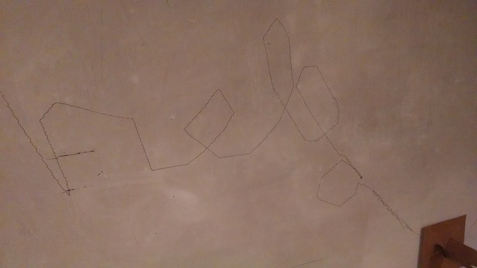

# plot-bot
A v-plotter / Polargraph-type drawing robot actuated with johnny-five and with simulation tools using HTML5 &lt;canvas>

# **!!! This readme needs a lot of work after the browserify refactor and many new features!**

`drawCanvas/drawcanvas.html` now shows an example of using the `opentype.js` module to simulate drawing the outline of arbitrary text in a solid TrueType font (see `drawCanvas/fontTest.js`).

You can draw straight lines by clicking and dragging on the canvas (line will start on mousedown and ends on mouseup), or by entering commands in the console like:

    plotBot.COLOR = "rgba(255,0,0,0.25)";
    moveRobotTo(getBipolarCoords(100,200));
    drawStraightLine(getBipolarCoords(100,100));

## Running the node server
Install node and npm. Then do:

    npm install
    browserify main.js -o static/js/bundle.js
    node server.js

Use mock-firmata to fake a Board by running in debug mode:

    node server.js debug

Then open up a browser to `localhost:3000` and click around to start doodling.

`fontTest.js` is an example of converting text to a coordinate series, it's very rudimentary right now but it works. You can uncomment it in `drawcanvas.html` to activate it.

You can manually extend/retract the stepper motors by pressing the following keys when the canvas is active:
<table>
<tr>
    <th>Motor</th>
    <th>Extend</th>
    <th>Retract</th>
</tr>
<tr>
    <td>Left</td>
    <td>f</td>
    <td>d</td>
</tr>
<tr>
    <td>Right</td>
    <td>j</td>
    <td>k</td>
</tr>
</table>

***

See [notes.md](notes.md) for more info.

This project is still very much in alpha!

